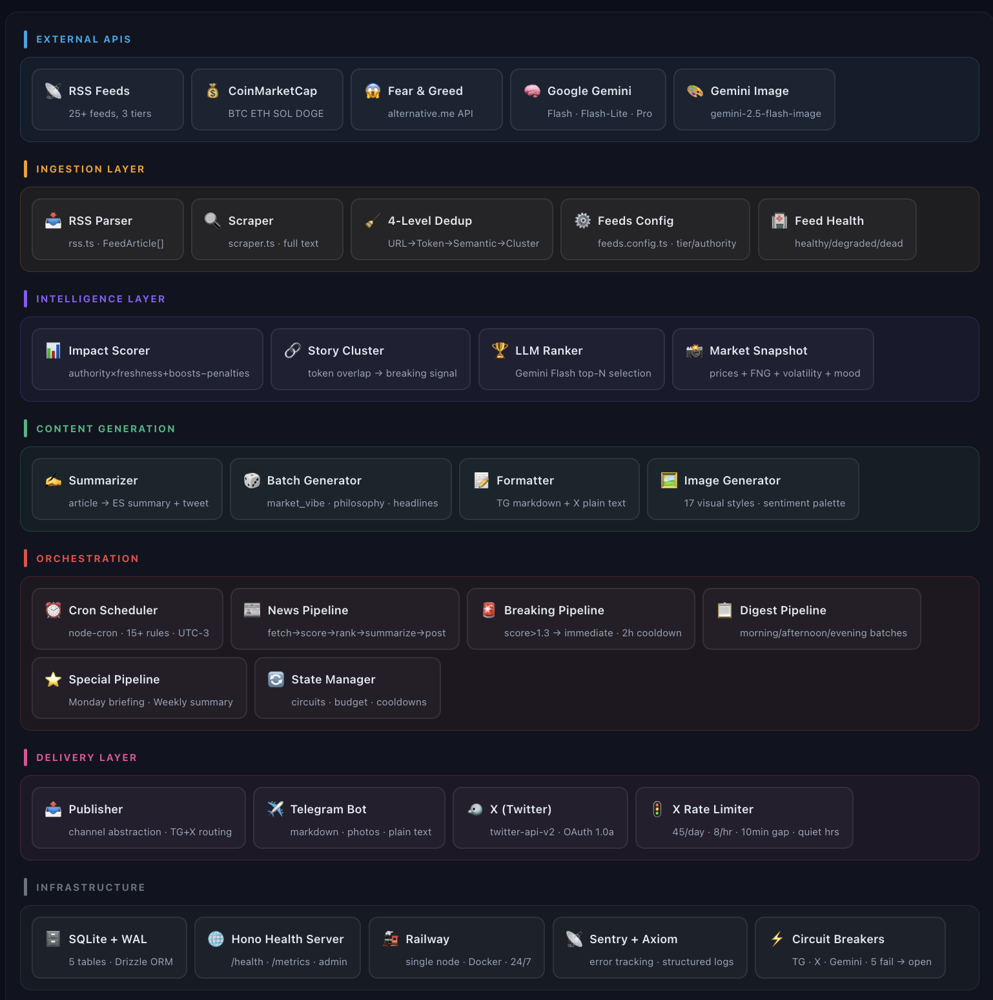
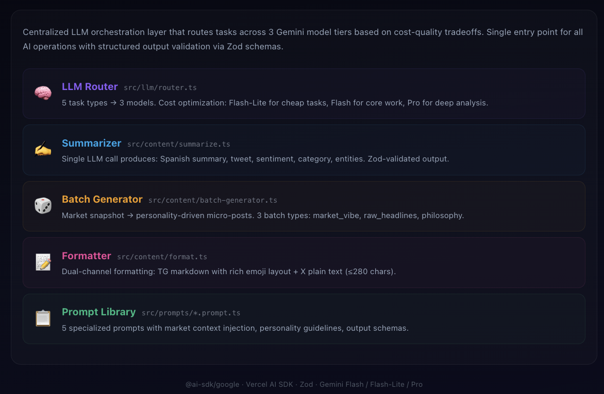
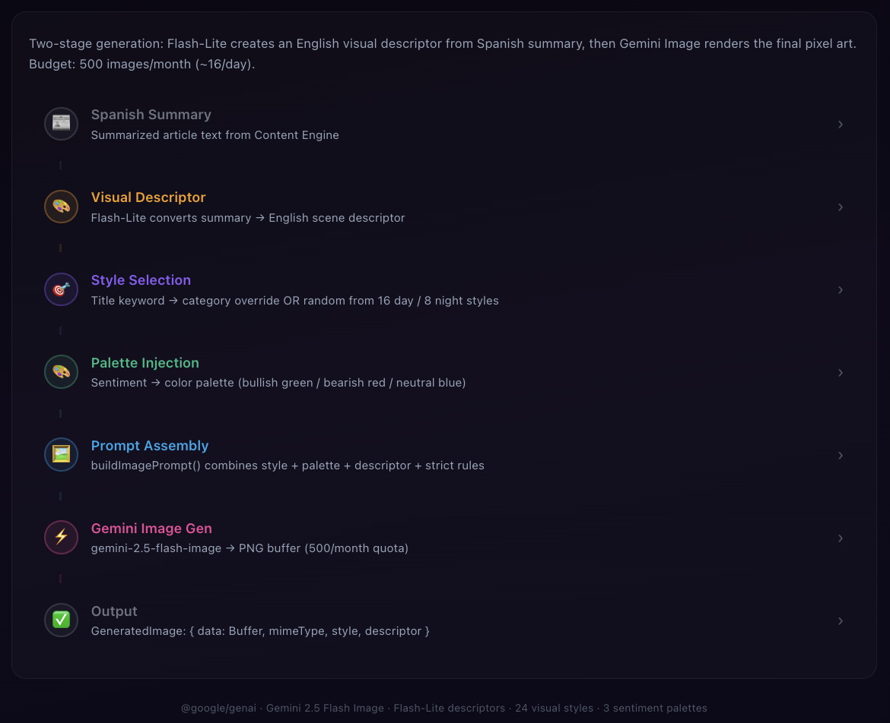
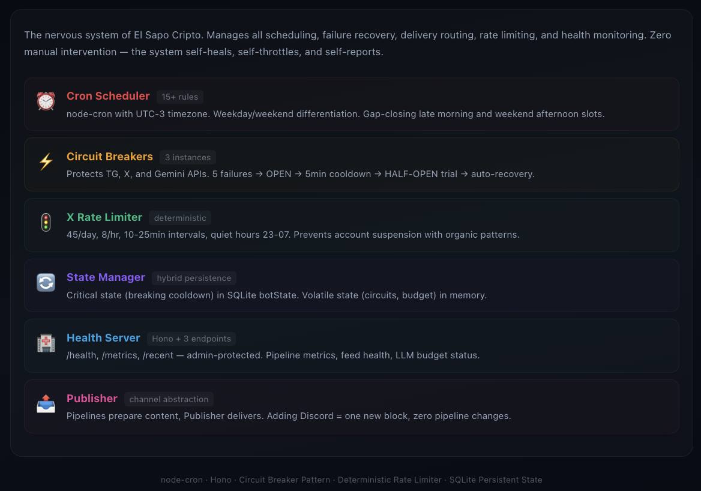
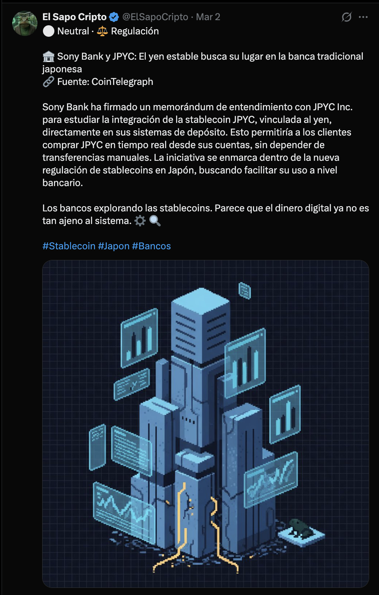
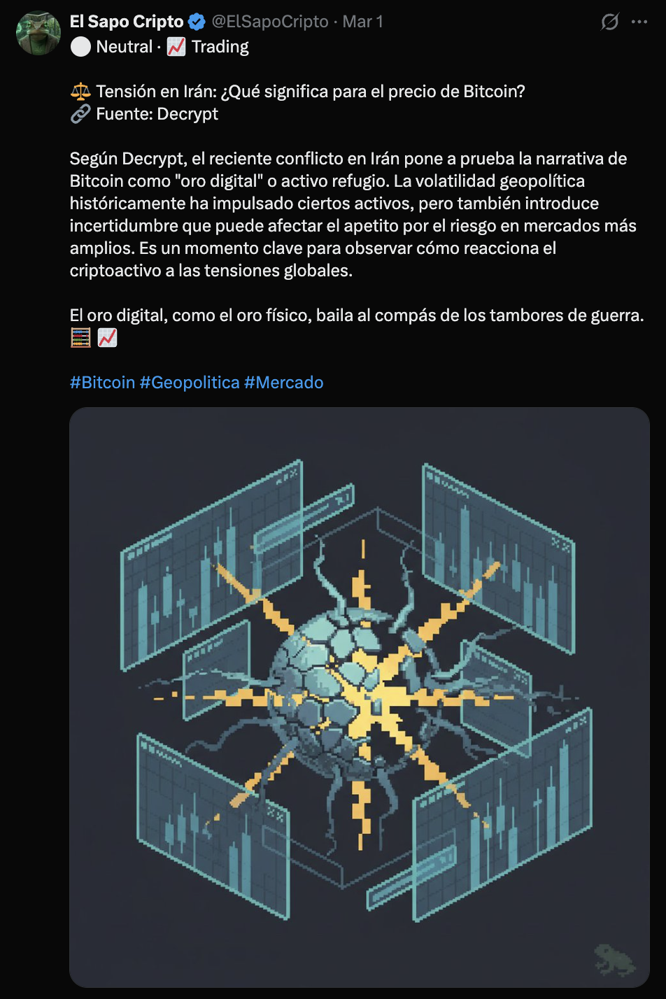
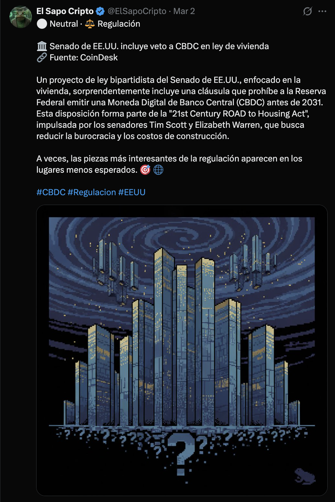

# 📡 Toad Wire

**Autonomous AI-powered news engine.**

Toad Wire is a fully autonomous system that monitors 25+ RSS sources, scores and ranks articles using multi-factor analysis, generates summaries and original pixel-art visuals via Google Gemini, and publishes optimized digests to Telegram and X — with zero manual intervention, 24/7.

> 🔗 **Live:** [elsapocripto.com](https://elsapocripto.com)

> ⚠️ This is a **portfolio showcase repository**. The production codebase is private. This repo contains architecture documentation, system design decisions, and visual references.

---

## System Overview

Toad Wire is a TypeScript monolith running on Railway (single node, Docker, SQLite with WAL mode). The system is decomposed into four major subsystems, each representing a self-contained engineering challenge:

| # | Subsystem | What it does |
|---|-----------|-------------|
| 1 | **News Intelligence Pipeline** | Ingestion, 4-level deduplication, multi-factor scoring, breaking detection |
| 2 | **LLM Orchestration & Content Engine** | Task-based model routing (Gemini Flash/Lite/Pro), structured summarization, batch content generation |
| 3 | **Generative Visual Pipeline** | 2-stage image generation: LLM descriptor → Gemini Image, 24 visual styles, sentiment-driven palettes |
| 4 | **Autonomous Operations Framework** | Cron scheduling, circuit breakers, rate limiting, health monitoring, graceful recovery |

---

## Architecture

### High-Level Data Flow

```
RSS Feeds (25+)
    │
    ▼
┌─────────────────────────────────────────────┐
│  INGESTION: Parse → Dedup (4 levels) → Save │
└─────────────────┬───────────────────────────┘
                  │
                  ▼
┌─────────────────────────────────────────────┐
│  INTELLIGENCE: Score → Cluster → Rank       │
│  (authority × freshness + keyword boosts    │
│   − duplicate penalty − spam penalty)       │
└─────────────────┬───────────────────────────┘
                  │
                  ▼
┌─────────────────────────────────────────────┐
│  CONTENT: Summarize (ES) → Format → Image   │
│  Gemini Flash  │  Flash-Lite  │  Flash Image │
└─────────────────┬───────────────────────────┘
                  │
                  ▼
┌─────────────────────────────────────────────┐
│  DELIVERY: Publisher → Telegram + X          │
│  (circuit breakers, rate limiter, jitter)   │
└─────────────────────────────────────────────┘
```

### Interactive Architecture Diagrams

Detailed interactive diagrams for each subsystem (built as React components):

<p align="center">
  
</p>

<p align="center">
  
</p>

<p align="center">
  
</p>

<p align="center">
  
</p>

---

## 1. News Intelligence Pipeline

Multi-source ingestion with intelligent scoring and breaking news detection.

**Ingestion:** 25+ RSS feeds organized into 3 tiers by authority (0.0–1.0). Feeds are health-monitored with automatic degradation tracking (healthy → degraded → dead).

**4-Level Deduplication:**
- **Level 0 — URL:** Exact URL match (free, instant)
- **Level 1 — Token overlap:** Jaccard similarity on tokenized titles
- **Level 2 — Semantic:** Cosine similarity on embeddings (catches paraphrased duplicates)
- **Level 3 — Story clustering:** Groups articles from different sources covering the same event

**Impact Scoring:**
```
ImpactScore = (authority × freshness) + keywordBoost + contextBoost
              − duplicatePenalty − spamPenalty
```

Keyword boosts are tiered: security events (+0.25), regulation (+0.20), LATAM regional relevance (+0.20), institutional moves (+0.20), macro signals (+0.15), major assets (+0.10).

**Breaking Detection:** When 3+ unique sources (or 2+ Tier-1 sources) cluster on the same story, the system triggers an immediate breaking news pipeline with a 2-hour cooldown between breaking posts.

---

## 2. LLM Orchestration & Content Engine

Centralized AI layer with cost-optimized model routing.

**Router Architecture:**

| Task | Model | Rationale |
|------|-------|-----------|
| `news`, `ranking` | Gemini 2.5 Flash | Core work — quality matters |
| `batch`, `goodnight` | Gemini 2.5 Flash-Lite | High volume, lower complexity |
| `weekly` | Gemini 2.5 Pro | Deep analysis, 1 call/week |

Flash-Lite handles ~60% of daily LLM calls at minimal cost. Pro is reserved for weekly deep analysis only.

**Structured Summarization:** Single LLM call produces: Spanish summary, X-ready tweet (≤280 chars), sentiment (bullish/bearish/neutral), category, and named entities — all validated through Zod schemas. No multi-step chains, no token waste.

**Batch Content Generation:** Market snapshot data (prices + Fear & Greed Index + volatility alerts) feeds into personality-driven micro-post generation across three content types: market commentary, curated headline threads, and crypto philosophy.

---

## 3. Generative Visual Pipeline

Two-stage AI image generation with 24 rotating visual styles.

**Pipeline:**
1. **Descriptor Stage:** Gemini Flash-Lite converts Spanish news summary into an English visual scene descriptor (abstract, symbolic — not literal illustration)
2. **Generation Stage:** Gemini 2.5 Flash Image renders pixel art using the descriptor + style + sentiment palette

**Style System:**
- 16 daytime styles (terminal, micro-matrix, circuit, market-topography, holo-chart, fracture, seismic-spike, oscilloscope, etc.)
- 8 nighttime styles (moonlit-terminal, sleeping-circuit, signal-constellation, etc.)
- Category-based overrides: security news → `fracture`/`seismic-spike`, DeFi → `vector-terrain`/`bio-circuit`, institutional → `holo-chart`/`continent-grid`

**Sentiment Palettes:**
- Bullish: neon green (#00ff41), upward energy
- Bearish: deep red (#ff2200), downward pressure
- Neutral: steel blue (#4a9eff), analytical calm

Budget: 500 image generations/month (~16/day). Fallback: if generation fails, post publishes without image.

### Sample Generated Posts

<p align="center">
  
  
</p>

<p align="center">
  
  
</p>

---

## 4. Autonomous Operations Framework

Self-healing infrastructure with zero manual intervention.

**Cron Scheduler:** 15+ rules covering morning digests, midday news, prime time posts (different schedules for weekdays vs weekends), breaking news scanning (every 10 min), weekly summaries, and maintenance jobs. All times in UTC-3 with quiet hours (23:00–07:00).

**Circuit Breakers:** Three independent instances protecting Telegram, X API, and Gemini. Pattern: CLOSED → 5 consecutive failures → OPEN (all requests blocked) → 5 min cooldown → HALF-OPEN (single trial) → success → CLOSED. Universal implementation, same code for all external APIs.

**X Rate Limiter:** Deterministic posting limits mimicking organic behavior — 45 tweets/day (API max: 50, 5 buffer), 8/hour, minimum 10 min between posts, randomized 10-25 min intervals for organic patterns.

**Publisher Abstraction:** Pipelines prepare content, Publisher delivers. Channel-agnostic design — adding Discord or WhatsApp requires one new block with zero changes to any pipeline.

**Graceful Shutdown:** SIGTERM handler performs WAL checkpoint before exit, ensuring zero data loss on Railway redeploys.

---

## Tech Decisions & Trade-offs

### Why SQLite over PostgreSQL?
The system runs as a single-process monolith on one Railway node. Write load is ~350 records/day (~0.004 writes/sec). SQLite with WAL mode handles 10,000+ writes/sec. PostgreSQL would add operational complexity (connection pooling, separate service, network latency) with zero benefit at this scale. Migration triggers are defined: second instance needed, >50K records without cleanup, or concurrent webhook writes.

### Why a Monolith?
Single Node.js process with cron-based scheduling. No message queues, no microservices, no Redis. In-memory state + SQLite persistence covers all requirements. The overhead of distributed infrastructure would provide negative ROI at current scale while adding failure modes.

### Why Task-Based LLM Routing?
Business logic declares intent (`'news'`, `'ranking'`, `'batch'`), router selects the model. Decouples cost optimization from pipeline logic. Switching a task to a different model = one line change in the router, zero changes in 15+ pipeline files.

### Why 4-Level Dedup?
RSS feeds from 25+ sources produce heavy overlap. Each dedup level catches what the previous missed: URL handles exact copies, token overlap catches reformatted titles, cosine similarity catches paraphrased content, story clustering catches multi-source coverage of the same event. Levels 0-1 are free (string ops), Level 2 uses embeddings, Level 3 uses token overlap on clusters.

### Why Pixel Art?
Generative AI image models produce inconsistent results with photorealistic or illustrative styles. Pixel art constraints (8-bit grid, no anti-aliasing, limited palette) force Gemini Image into a narrow output space, producing consistently recognizable brand aesthetic across 500+ monthly images.

---

## Tech Stack

| Layer | Technology |
|-------|-----------|
| Runtime | TypeScript, Node.js |
| Framework | Hono (HTTP server) |
| Database | SQLite (WAL mode) + Drizzle ORM |
| AI / LLM | Google Gemini (Flash, Flash-Lite, Pro, Flash Image) via Vercel AI SDK |
| Scheduling | node-cron (15+ rules, UTC-3) |
| Delivery | twitter-api-v2 (OAuth 1.0a), Telegram Bot API |
| Monitoring | Pino (structured logging), Sentry (error tracking), Axiom (log aggregation) |
| Infrastructure | Railway (Docker, single node), Vercel (landing page) |
| Validation | Zod (LLM output schemas, config validation) |

---

## Production Metrics

- **Uptime:** 24/7 on Railway with auto-recovery
- **Output:** 15-20 AI-generated posts/day across Telegram + X
- **Sources:** 25+ RSS feeds with health monitoring
- **LLM Calls:** ~50-80/day across 3 Gemini model tiers
- **Images:** ~15 generated/day (500/month quota)
- **Latency:** News pipeline end-to-end ~8-15 sec, breaking news ~5-10 sec

---

## Project Status

- ✅ **CORE I** — News Intelligence + Content Engine + Visual Pipeline + Operations — **Production**
- 🔧 **CORE II** — Social Intelligence Layer (X engagement, persona engine, anti-ban system) — **In Development**

---

## Author

Built as a solo engineering project demonstrating end-to-end AI system design: from data ingestion and scoring algorithms through LLM orchestration and generative AI, to production infrastructure with self-healing capabilities.

---

*El Sapo no duerme. El Sapo observa.* 🐸
